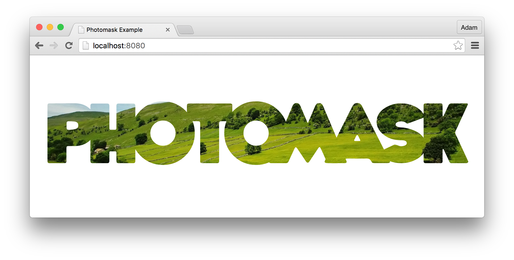

# Photomask



> Apply an alpha mask to your text using SVG and CSS `mask` with custom font support.


&nbsp;

&nbsp;


* **npm:** `npm install photomask --save`


<sup>Tested with Chrome 46.0, Opera 33.0, Firefox 42.0 and Safari 9.0.1.</sup>

## Getting Started

Photomask provides a `x-photomask` element that uses HTML5 custom elements to extend the `HTMLImageElement.prototype` object.

```html

```

**Note:** For the image the `src` attribute will be used, and the text will be taken from the `img` element's `alt` attribute. When creating the `img` element, you're required to add the `is="x-photomask"` attribute which is a registered [custom element](http://www.html5rocks.com/en/tutorials/webcomponents/customelements/).

Once you have inserted your `img[is="x-photomask"]` element into the DOM, Photomask will apply the mask automatically for you.

### Fine-tuning via Padding

Photomask attempts to recursively compute the ideal font size for your supplied text using `canvas`' `measureText` method &ndash; yet some fonts are not computed perfectly. For these instances Photomask allows you to style your `img` element using the standard `padding` property via CSS to adjust for imperfections.

Padding will be applied as a buffer around the image allowing all of the text to fit snuggly inside the container. Likewise if you wish to add a little padding on the top to correct the vertical positioning, `padding-top` is also recognised to allow the text to be positioned perfectly.

```css
img[is="x-photomask"] {
    padding: 4px 15px 0 15px;
}
```

### Using Custom Fonts

By supplying the `font-family` property you can change the font that is rendered with Photomask. As long as the font has been added to your page &mdash; such as via the `@font-face` method &mdash; then the font will be rendered to the SVG container correctly.

```css
img[is="x-photomask"] {
    font-family: Arial, Tahoma, Helvetica, san-serif;
}
```

### Adjusting Background

In some cases you may wish to adjust the background to allow a different segment of the background to shine through &mdash; the fine-tuning for the background can be done using the `background-position` property.

```javascript
img[is="x-photomask"] {
    background-position: 100px 50px;
}
```

# Manual Rendering

Photomask uses the `transform` function to provide the rendering of the text with a mask applied.

```javascript
import {transform} from 'photomask';

// ...

const imgElement = document.querySelector('img');
transform(imgElement, { text: 'Photomask', image: 'path/to/image.png' });
```

**Note:** When using the custom element approach, the values are taken directly from the element &mdash; with the `src` and `alt` attributes &ndash; however when you invoke `transform` manually, you need to pass the image and text to the function as the second argument.

However Photomask always conveniently exports the `readAttributes` function, so you can use that to pass in to the `transform` function.

```javascript
import {transform, readAttributes} from 'photomask';

// ...

const imgElement = document.querySelector('img');
transform(imgElement, readAttributes(imgElement));
```

